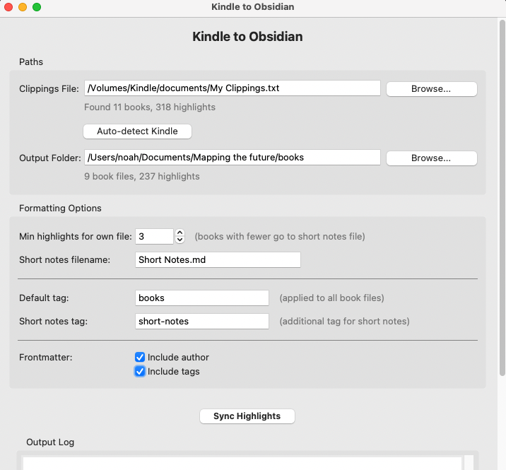

# Kindle to Obsidian

[](https://www.python.org/downloads/)
[](https://opensource.org/licenses/MIT)
[]()

Extract your Kindle highlights and notes into Obsidian markdown files.



## Quick Start

```bash
git clone https://github.com/NoahLloyd/kindle-to-obsidian.git
cd kindle-to-obsidian
./run.sh
```

The GUI will open. Select your files and click Sync.

---

## Features

- **GUI Application** - Easy-to-use scrollable interface for selecting files and customizing output
- **Incremental Sync** - Only adds new highlights, never duplicates
- **Smart Organization** - Books with many highlights get their own files; books with few are grouped together
- **Note Linking** - Your notes are automatically linked to their corresponding highlights
- **Auto-Cleanup** - Removes duplicate partial notes from Kindle's incremental saving
- **Cross-Platform** - Works on macOS, Windows, and Linux
- **Persistent Settings** - Your configuration is saved and restored automatically

## Requirements

- Python 3.12+ (recommended for best Tkinter compatibility on macOS)
- For macOS users with pyenv: Python must be built with tcl-tk support

## Installation

### 1. Clone the repository

```bash
git clone https://github.com/yourusername/kindle-to-obsidian.git
cd kindle-to-obsidian
```

### 2. Set up Python (macOS with pyenv)

If you're using pyenv on macOS, install Python 3.12 with tcl-tk support:

```bash
brew install tcl-tk@8
pyenv install 3.12.4
```

### 3. Run the application

The easiest way is to use the launcher script:

```bash
./run.sh
```

This will:

- Create a virtual environment if needed
- Install dependencies automatically
- Launch the GUI

### Manual Setup

Alternatively, set up manually:

```bash
# Create virtual environment with Python 3.12
~/.pyenv/versions/3.12.4/bin/python -m venv venv

# Activate and install dependencies
source venv/bin/activate  # On Windows: venv\Scripts\activate
pip install -r requirements.txt

# Run
python kindle_to_obsidian.py
```

## Usage

### GUI Mode (Default)

Simply run:

```bash
./run.sh
```

The GUI allows you to:

1. **Select your clippings file** - Browse to your `My Clippings.txt` or auto-detect a connected Kindle
2. **Choose output folder** - Select your Obsidian vault's books folder
3. **Customize formatting** - Adjust tags, minimum highlights threshold, and frontmatter options
4. **Sync with one click** - Watch the progress in the scrollable output log

All settings are automatically saved and restored on next launch.

### CLI Mode

For automation or scripting, use CLI mode:

```bash
./run.sh --cli
```

Or directly:

```bash
source venv/bin/activate
python kindle_to_obsidian.py --cli
```

CLI options:

```
-i, --input PATH     Path to My Clippings.txt (overrides saved config)
-o, --output PATH    Output directory (overrides saved config)
--dry-run            Preview changes without writing files
--show-config        Display current configuration
```

## Configuration

Settings are stored in `config.yaml` in the project directory. You can edit this file directly or use the GUI.

```yaml
paths:
  kindle_clippings: /Volumes/Kindle/documents/My Clippings.txt
  output_directory: ~/Documents/Obsidian/Books

output:
  min_highlights_for_own_file: 3
  short_notes_filename: Short Notes.md
  default_tag: books
  short_notes_tag: short-notes

frontmatter:
  include_author: true
  include_tags: true
```

### Platform-Specific Kindle Paths

| Platform    | Typical Kindle Path                                   |
| ----------- | ----------------------------------------------------- |
| **macOS**   | `/Volumes/Kindle/documents/My Clippings.txt`          |
| **Windows** | `E:\documents\My Clippings.txt` (drive letter varies) |
| **Linux**   | `/media/username/Kindle/documents/My Clippings.txt`   |

The app will auto-detect your platform and suggest the appropriate default path.

## Output Format

### Book Files

Each book with 3+ highlights (configurable) gets its own file:

```markdown
---
author: "Author Name"
tags:
  - books
---

---

<a href="kindle:abc12345"></a>
The first highlight from the book appears here.

---

<a href="kindle:def67890"></a>
Another highlight with a note attached.
<a href="kindle:note1234"></a>

> This is my note about the highlight above

---
```

### Short Notes File

Books with fewer highlights are grouped together:

```markdown
---
tags:
  - books
  - short-notes
---

## Book Title One

_Author Name_

---

<a href="kindle:abc12345"></a>
A highlight from this book.

---

## Book Title Two

_Another Author_

---

<a href="kindle:xyz98765"></a>
A highlight from this other book.

---
```

### How Tracking Works

The `<a href="kindle:..."></a>` tags are invisible in Obsidian but allow the script to track which highlights have already been exported, preventing duplicates on subsequent syncs.

## Project Structure

```
kindle-to-obsidian/
├── kindle_to_obsidian.py    # Entry point
├── run.sh                   # Launcher script
├── config.yaml              # Your saved settings
├── requirements.txt         # Python dependencies
├── README.md
└── src/
    ├── cli.py               # Command-line interface
    ├── config/
    │   └── settings.py      # Settings management
    ├── core/
    │   ├── parser.py        # Clippings file parser
    │   └── writer.py        # Markdown file writer
    └── ui/
        ├── app.py           # Main window (scrollable)
        ├── paths_frame.py   # File/folder selection
        ├── formatting_frame.py  # Format options
        └── sync_frame.py    # Sync button and log
```

## Troubleshooting

### "Tkinter GUI not available" on macOS

This usually means Python wasn't built with a compatible Tcl/Tk. Fix it by:

1. Install tcl-tk: `brew install tcl-tk@8`
2. Install Python 3.12 via pyenv (it will use the Homebrew tcl-tk)
3. Recreate the venv: `rm -rf venv && ./run.sh`

### "Kindle not found"

- Make sure your Kindle is connected via USB
- Check that it's mounted (appears in Finder/File Explorer)
- Use "Auto-detect Kindle" button or browse manually

### Highlights not appearing

- Kindle DRM limits how much you can highlight (usually ~10% of a book)
- Messages like "You have reached the clipping limit" are automatically filtered out

### Duplicate partial notes

The script automatically removes incremental note saves. Only the final, complete version of each note is kept.

## License

MIT License - feel free to use and modify as you like.
